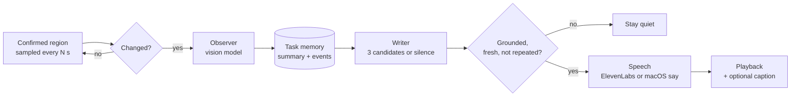

# backseat

[](https://github.com/zainbabar/backseat/actions/workflows/ci.yml)


[](LICENSE)

A sarcastic friend watching over your shoulder. Select part of your screen, and Backseat
follows what you're doing and occasionally says something about it out loud.

<!-- Demo: add a short GIF or video here. -->

> *Observed failure, then pass:* "The test passed. I'll notify the historical society."
> *Returned to an earlier bug:* "Welcome back. Your bug kept the seat warm."
>
> (Tone examples from the writer prompt, not recorded output.)

It's commentary, not a copilot: no coding hints, fixes, or LeetCode spoilers. It only
sees the rectangle you confirm, never launches on its own, and stops when you quit.

## How it works



- **Two stages.** The **observer** sees the current and previous screenshots and turns them
  into factual events, each with visible evidence; interpretations are marked uncertain. The
  **writer** never sees screenshots. It gets text context and a fresh, certain event, then
  writes three candidates and picks one, or chooses silence.
- **Grounding is enforced in code, not just requested.** Every remark must cite the event IDs
  it relies on. The runtime rejects unknown, uncertain, or retracted references and exact
  repeats before anything is spoken.
- **Nothing stale gets said.** One worker per stage, no queued frames. Pause, corrections,
  task or region changes bump an epoch so in-flight output is discarded, and output older than
  `stale_seconds` or superseded by a newer event never plays.
- **Memory across sessions.** Task context, delivered remarks, and your feedback persist in
  local SQLite, so it can make callbacks to earlier events and learn what you find funny.
  Resumed tasks keep their original timestamps and start without a previous screenshot, so
  yesterday's failures are history, not evidence about what's on screen now.
- **Screen content is untrusted.** Text on screen and prior observations are treated as data;
  they can't change the narrator's role or trigger actions.

## Quick start

Requires macOS, Python 3.12–3.13, and [uv](https://docs.astral.sh/uv/).

```sh
git clone https://github.com/zainbabar/backseat && cd backseat
uv sync
cp .env.example .env   # add OPENAI_API_KEY; ElevenLabs keys are optional
```

Enable your terminal under **System Settings → Privacy & Security → Screen Recording**
(named **Screen & System Audio Recording** on some versions), then quit and reopen it.
Backseat checks this before capturing. It never records audio or uses the microphone.

```sh
uv run backseat preview                 # select and confirm a region; no API calls
uv run backseat once --text-only        # one observation and one printed remark
uv run backseat run                     # the full companion; type commands while it runs
uv run backseat run --persona documentary --captions --recap
```

Only `OPENAI_API_KEY` is required. Without `ELEVENLABS_API_KEY` and
`ELEVENLABS_VOICE_ID`, Backseat speaks with the built-in macOS voice, so remark text stays on
your machine. With them, it uses your ElevenLabs voice (no default voice is substituted).

## Personas

`--persona NAME` (or `persona` in `backseat.toml`) changes the writer's voice. Every persona
follows the same grounding and no-advice rules.

| Persona | Style |
| --- | --- |
| `friend` (default) | Sarcastic friend hanging over your shoulder. |
| `commentator` | Overexcited sports commentator; huge stakes for small moments, instant replays. |
| `documentary` | Hushed nature-documentary narrator observing you in your natural habitat. |
| `coach` | Weary, deadpan coach. Pure attitude, never technique or advice. |

## While it's running

Type a command in the terminal and press Enter:

| Command | Effect |
| --- | --- |
| `pause` / `resume` | Stop/restart capture and requests. Pausing stops audio and discards pending output. |
| `region` / `region 2` | Reselect on the current/second display. Keeps task memory, resets image comparison. |
| `task TEXT` | Archive the current task and start a new one. |
| `context TEXT` | Add context a screenshot can't show ("this is a practice exercise"). |
| `correct TEXT` | Fix a misunderstanding: prior events become unreliable and pending jokes are dropped. |
| `taste TEXT` | Save a humor preference ("less theatrical, more dry understatement"). |
| `funny` / `boring` | Rate the last remark. Saved as a style example, also for future tasks. |
| `memory` | Print the compact task context and humor preferences. |
| `stats` | Requests, tokens, and latency per stage, plus speech requests and characters. |
| `quit` / Ctrl+C | Stop audio and exit. With `--recap`, `quit` first delivers the recap; Ctrl+C skips it. |

Text commands accept 1–2000 characters. Ending terminal input (EOF) works like `quit`.
Backseat also prints short status lines (events found, writer skipped or silent) that report
counts and decisions, never screen contents.

## Commands and flags

| Command | Behavior |
| --- | --- |
| `preview` | Select and confirm a crop. No model calls, no memory changes. |
| `once` | Observe one crop and deliver at most one remark. Uses saved humor preferences but isolated, unsaved task history. If nothing certain is observed, it exits without calling the writer. |
| `run` | Keep observing until you quit. Asks whether to resume the last task or start fresh. |

| Flag | What it does |
| --- | --- |
| `--monitor N` | Display number (1-based); omit to list displays and choose. |
| `--persona NAME` | `friend`, `commentator`, `documentary`, or `coach` for this run. |
| `--voice auto\|elevenlabs\|say` | Speech engine. `auto` (default) uses ElevenLabs when both keys are set, otherwise macOS `say`. |
| `--text-only` | Print remarks; no audio. |
| `--captions` | Show each remark as a click-through subtitle beside the watched region. See [Captions](#captions). |
| `--recap` | `run` only: on `quit`, deliver a short recap built from this session's certain events. One extra writer call. |
| `--resume` / `--fresh` | `run` only: skip the resume question. `--fresh` keeps humor preferences and archived tasks. |
| `--task "TEXT"` | Name a new task (`run --fresh`) or the goal for a `once` test. |
| `--interval SECONDS` | Override both the sampling interval and post-speech cooldown for this run (≥ 1). |
| `--observe-only` | Run only the observer and print what it sees; no writer or speech. Can't combine with `--recap` or `--captions`. |
| `--save-captures DIR` | Opt in to saving submitted crops as PNGs (`preview` saves `preview.png`). Use `captures` to stay within `.gitignore`. |
| `--config PATH` | Load a different TOML file. A missing file uses built-in defaults. |
| `--chatty` | Testing: request a remark every interval, even on unchanged screens; bypasses cooldown and writer silence. |
| `--force-remark` | Testing: force a remark on the first capture only. |

Noninteractive `run` requires `--resume` or `--fresh`, and should pass `--monitor`.

<details>
<summary><b>Testing modes in detail</b></summary>

`--chatty` and `--force-remark` ask the writer to speak even without a new event. If it
still chooses silence or returns an unusable or malformed response, Backseat uses a short
generic narrator line rather than retrying. Testing requests are recorded as narrator
controls, never as desktop progress, and factual evidence checks stay in place. If the
observer's output is rejected in testing mode, the writer gets no current scene facts.
These modes bypass the post-speech cooldown and exact-repeat rejection. Pause, quit,
corrections, region changes, and expiration still apply, and speech never overlaps.
`--observe-only` takes priority over both.

</details>

## Captions

`--captions` shows each remark in a small subtitle bubble, which helps for screen recordings
or when audio is off. The bubble is a real window, so screen captures would include it. To
keep Backseat from reading its own captions, the bubble is only placed **outside** the
watched region (below, above, right, or left of it, on the same display). If the region
leaves no room, captions are skipped with a one-time notice. Select a region smaller than
the full display to use them.

The bubble ignores clicks and never takes keyboard focus. Backseat keeps the macOS app in a
non-activating state except during region selection, so focus also returns to your terminal
after you confirm a region. Behavior over full-screen apps in their own Space is untested.

## Configuration

`backseat.toml` in the launch directory. `--interval` and `--persona` override it per run.

| Setting | Default | Meaning |
| --- | --- | --- |
| `model` | `"gpt-5.4-mini"` | Fallback OpenAI model for both stages. |
| `observer_model` | `"gpt-5.4-mini"` | Model that reads screenshots and updates context. |
| `writer_model` | `"gpt-5.4-mini"` | Model that writes, selects, and recaps remarks. |
| `speech_model` | `"eleven_v4"` | ElevenLabs model; the voice ID comes from `.env`. |
| `say_voice` | unset | macOS voice name for `say` (`say -v '?'` lists them). Unknown names fall back to the system voice. |
| `persona` | `"friend"` | Commentary style; see [Personas](#personas). |
| `sample_seconds` | `30` | Seconds between local screen checks (≥ 1). |
| `cooldown_seconds` | `60` | Minimum gap after speech ends before the next remark (≥ 0). |
| `change_threshold` | `0.02` | Fraction of thumbnail pixels whose brightness must change by > 20 before calling the observer. |
| `image_max_edge` | `2560` | Maximum model-input width/height after proportional resizing (≥ 256). |
| `api_timeout_seconds` | `20` | Timeout for each provider call and local speech synthesis. |
| `stale_seconds` | `60` | Pending output older than this is discarded before delivery. |

For quick testing without editing the file: `uv run backseat run --resume --interval 10`.

## Privacy and data

- **Capture:** only the rectangle you select and confirm in the preview. Fractional crop
  coordinates handle Retina scaling; the preview shows the exact model-input resolution so
  you can check that text is readable. On an ultrawide, select your editor rather than
  the whole display.
- **Screenshots** stay in memory unless you pass `--save-captures`. Only cropped images are
  sent to OpenAI, with `store=false` (provider retention policies still apply).
- **Speech:** ElevenLabs receives only the selected remark. With the local voice, nothing
  leaves your machine for speech; the text is passed to `say` over stdin.
- **Memory:** task summaries, events, delivered remarks, feedback, and humor preferences are
  saved in `.backseat/memory.sqlite` by `run`. Model-written summaries can include details
  visible in your crops and are sent back as context on later calls. `once` and `preview`
  never write memory. Delete `.backseat/` to reset everything. Unreadable databases are
  reported, never overwritten; save failures pause the companion instead of silently
  dropping context.
- **Logs:** errors report fixed reasons and exception types only, never provider response
  bodies, screen text, or keys. No telemetry, no background launch, no microphone, no
  computer control.

## Cost and limits

Each changed screen costs an observer request (two images after the first), and each
eligible event costs a writer request, even when the writer stays silent. Unchanged screens
are compared locally and cost nothing. `stats` shows per-stage tokens and latency; use your
provider dashboards for billing and spending limits.

Limitations worth knowing:

- macOS only (Screen Recording permission, `afplay`, `say`).
- It sees samples, not video: nothing between captures or while paused.
- Model output can still be inaccurate, repetitive, or unfunny. Event references show which
  recorded facts a remark used, not that every sentence is true. Use `correct`, `boring`,
  and `taste` to steer it.
- `--resume` loads only the most recently updated task.
- Requests already sent can't be recalled. Shutdown waits for them to finish or time out,
  but their output is never applied or played after invalidation.

## Development

```sh
uv run pytest
uv run ruff check . && uv run ruff format --check .
```

The tests use fake providers, fake images, and offscreen Qt. They never capture your desktop
or spend API credits. They cover event transitions, grounding and repeat rejection, memory
and resume/fresh, corrections, invalidation on pause/region/task changes, stale and
malformed output, testing modes, persona prompts, recap validation, local-voice invocation,
caption placement, and capture-window cleanup. Mock HTTP tests exercise the real OpenAI SDK's
structured-output parsing.

The tests don't establish humor quality, end-to-end latency, or how audio sounds. Caption
on-screen placement, window level, and focus behavior were checked manually against the
macOS window server (macOS 26) but aren't covered by CI. Prompts live in
`src/backseat/providers.py`.

## License

[MIT](LICENSE)
